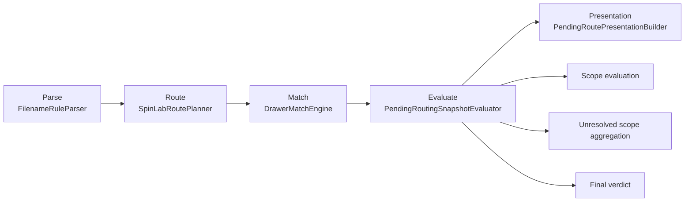

# Import Pipeline Evaluate Flow (V2.2.1)

This document complements `ROUTING_LAYER_BOUNDARIES.md` with an executable view of how one pending item moves through the five-stage routing pipeline.

## Stage Responsibilities

- `Parse`: Tokenization + semantic extraction only. No route verdict.
- `Route`: Build candidate `RoutePlan` and channel resolutions only.
- `Match`: Resolve `sampleKey -> drawer` against Library index only.
- `Evaluate`: Build `PendingRoutingSnapshot` from route + match signals.
- `Presentation`: Convert evaluated snapshot to UI-facing labels/badges/warnings.

## Evaluate Decision Rules

Source of truth:
- `Sources/SpinLabApp/Import/Evaluate/PendingRoutingSnapshotEvaluator.swift`
- `Sources/SpinLabApp/Import/Evaluate/PendingRoutingRuleBook.swift`
- `Sources/SpinLabApp/Import/Evaluate/RoutingExplanationBook.swift`

Rule table:

| Condition | Output |
|---|---|
| `routePlan.channelResolutions` contains non-empty `sampleKey` | Create scope evaluation entries |
| Scope has `resolution.warning` | `warningReason = upstreamResolutionWarning` |
| Scope has no `resolution.warning` and no matched drawer | `warningReason = noMatchingLibraryDrawer` |
| Any scope channel is not `file` | `mode = channelLevel` |
| All scopes are matched and scope list is non-empty | `verdict = libraryMatched` |
| Otherwise (including empty scopes) | `verdict = reviewRequired` |
| `routePlan.unresolvedChannels` + unmatched scope names | `unresolvedScopes` (de-duplicated, order preserved) |

## Why Empty Scope Means Review Required

`PendingRoutingRuleBook` treats empty scopes as `reviewRequired` to avoid false-positive auto-routing when parser/route did not produce a reliable sample signal.

