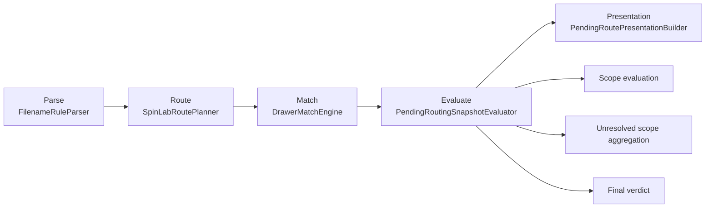

# Inbox Routing Pipeline

The pipeline transforms a dropped file into a pending routing item with resolved sample targets and queue verdict. It runs in five stages: Parse → Route → Match → Evaluate → Presentation.

---

## Layer Boundaries

Directory contract for `Sources/SpinLabApp/Import`:

- `Parse/`: filename tokenization and semantic extraction only.
- `Route/`: route planning only (candidate generation, no final verdict).
- `Match/`: Library drawer matching/indexing only.
- `Evaluate/`: final routing verdict and warning reasoning only.
- `Presentation/`: UI-facing route/warning projection only.
- `Rules/`: rule loading/compilation/runtime metadata only.

Minimum dependency constraints:

1. `Route/` can depend on `Parse/` and `Rules/`; it must not depend on `Presentation/`.
2. `Evaluate/` can depend on `Route/` and `Match/`; it must not call parser internals.
3. `Presentation/` can depend on `Evaluate/` outputs only; it must not invoke rule loading or matching.
4. App layer must access routing via `InboxRoutingState` + capability contracts, not concrete internals.

Enforcement in code:

- `InboxRoutingState` is the only App-level routing façade.
- `RoutingCapabilities` + `RuleRuntimeCapability` are the capability boundaries consumed by App state.

---

## Five-Stage Evaluate Flow



### Stage Responsibilities

- `Parse`: Tokenization + semantic extraction only. No route verdict.
- `Route`: Build candidate `RoutePlan` and channel resolutions only.
- `Match`: Resolve `sampleKey -> drawer` against Library index only.
- `Evaluate`: Build `PendingRoutingSnapshot` from route + match signals.
- `Presentation`: Convert evaluated snapshot to UI-facing labels/badges/warnings.

### Evaluate Decision Rules

Source of truth:
- `Sources/SpinLabApp/Import/Evaluate/PendingRoutingSnapshotEvaluator.swift`
- `Sources/SpinLabApp/Import/Evaluate/PendingRoutingRuleBook.swift`
- `Sources/SpinLabApp/Import/Evaluate/RoutingExplanationBook.swift`

| Condition | Output |
|---|---|
| `routePlan.channelResolutions` contains non-empty `sampleKey` | Create scope evaluation entries |
| Scope has `resolution.warning` | `warningReason = upstreamResolutionWarning` |
| Scope has no `resolution.warning` and no matched drawer | `warningReason = noMatchingLibraryDrawer` |
| Any scope channel is not `file` | `mode = channelLevel` |
| All scopes are matched and scope list is non-empty | `verdict = libraryMatched` |
| Otherwise (including empty scopes) | `verdict = reviewRequired` |
| `routePlan.unresolvedChannels` + unmatched scope names | `unresolvedScopes` (de-duplicated, order preserved) |

### Why Empty Scope Means Review Required

`PendingRoutingRuleBook` treats empty scopes as `reviewRequired` to avoid false-positive auto-routing when parser/route did not produce a reliable sample signal.

---

## Algorithm Rules

### Rule Source

- Filename matching rules live in `filename_rules.json` and are loaded via `RuleLoader.shared`. Do not hard-code patterns in Swift source.

### Parse Sources

- file name
- parent folder
- grandparent folder

### File Type Policy

- Included in import/classification: `.dat`, `.lvm`
- Ignored in classification/routing: `.gph`

### Sample Key Rules

- Sample key prefixes are configured in `config/sample_identification.json` (`sampleId.matches`), not hard-coded in source.
- Each entry uses an explicit match op: `starts-with` (current canonical), `equals`, or `contains`. Regex patterns are not used since the v4 schema migration.
- Folder-derived sample is allowed as fallback only when unique.

### Channel Mapping

- Channel aliases: `ch1/c1`, `ch2/c2`, `ch3/c3`.
- Channel-level mapping has priority over default file-level sample mapping.

### Unified Routing Formula

For each channel, route sample key is:
```
channelSampleKey ?? defaultSampleKey ?? folderDerivedSampleKey
```

Then group channels by sample key into route targets.

This single rule must handle both:
- one file → one sample
- one file → multiple samples

### Conflict Behavior

- If sample mapping is unresolved or conflicting, never auto-route silently.
- Mark as review-required and require manual confirmation.

### Queue Status Rules

Root definition:
- Queue status is based on whether parsed sample routing can be mapped to the required existing Library drawer target(s).

File-level delivery:
- If the file-level route maps to an existing drawer, mark as `library-matched`.
- If not, mark as `review-required`.

Channel-level delivery:
- Every reported channel must map to its own existing drawer target.
- If any channel cannot be uniquely mapped to a drawer target, mark as `review-required`.
- Route unresolved metadata alone does not force review when final drawer mapping is still unique and valid.

Complement policy:
- File-level sample info may complete missing channel sample info.
- Channel-to-channel cross-completion is not allowed.

### Drawer Matching

- Matching is token-coverage-based: normalize sample input and drawer keys into uppercase token sets; split alpha-numeric components during tokenization; input token set must be subset of candidate drawer token set.
- Success contract: exactly one candidate → mapped drawer; zero or multiple candidates → unresolved (`?`).

### Duplicate Import Guard

- Duplicate import match rule: `fileName + contentHash`.
- If matched, reject duplicate import and do not create a new pending route item.

### Conditions and Tags

Parse and preserve:
- workflow
- measurement tags
- substrate/device-level hints
- conditions (`temperature`, `current`, `field`)

Persist both raw and normalized values in archive metadata.

---

## Pipeline Invariants

- **Parse stage boundary**: Parse stage must never make routing decisions. All routing logic is deferred to Route and later stages.
- **Suggestion-only metadata**: Parsed metadata is suggestion-only until the user explicitly confirms. Nothing is archived on parse.
- **Duplicate filename handling**: Duplicate filenames in queue get a sequence suffix appended; they are never silently overwritten.
- **Token-coverage matching**: Drawer matching uses token-coverage semantics — input token set must be subset of drawer token set. Exactly one candidate = match; zero or multiple = unresolved (`?`).
- **Route unresolved does not force review**: Unresolved route metadata alone does not force `review-required` when the final drawer mapping is still unique and valid.
- **Test coverage**: Extensive unit tests cover parse, route, match, and evaluate stages. See `V211RoutePlannerTests.swift`, `V221DrawerMatchEngineTests.swift`, `V221RoutePresentationTests.swift`, `V230ApplyTests.swift`.

---

## Code Map

- `Sources/SpinLabApp/Import/ImportPipeline.swift` — entry point; orchestrates the 5-stage pipeline
- `Sources/SpinLabApp/Import/Parse/FilenameRuleParser.swift` — tokenization and semantic extraction
- `Sources/SpinLabApp/Import/Parse/SampleKeyNormalizer.swift` — sample key normalization for drawer matching
- `Sources/SpinLabApp/Import/Parse/SampleSemanticDescriptor.swift` — semantic descriptor model for parsed fields
- `Sources/SpinLabApp/Import/Parse/SampleTokenization.swift` — token-set construction for coverage matching
- `Sources/SpinLabApp/Import/Route/RoutePlanner.swift` — builds candidate RoutePlan and channel resolutions
- `Sources/SpinLabApp/Import/Route/FileRoutingRuleBook.swift` — routing rule evaluation logic
- `Sources/SpinLabApp/Import/Route/RoutingCapabilities.swift` — capability contract consumed by App layer
- `Sources/SpinLabApp/Import/Match/DrawerMatchEngine.swift` — token-coverage drawer matching against Library index
- `Sources/SpinLabApp/Import/Evaluate/PendingRoutingSnapshotEvaluator.swift` — builds PendingRoutingSnapshot from route + match signals
- `Sources/SpinLabApp/Import/Evaluate/PendingRoutingRuleBook.swift` — verdict rules (empty scope → reviewRequired, etc.)
- `Sources/SpinLabApp/Import/Evaluate/RoutingExplanationBook.swift` — warning reason construction
- `Sources/SpinLabApp/Import/Presentation/PendingRoutePresentation.swift` — UI-facing route/warning projection
- `Sources/SpinLabApp/App/State/InboxRoutingState.swift` — App-level routing façade; sole routing surface for App layer
- `Sources/SpinLabApp/Import/Rules/RuleLoader.swift` — runtime rule loading and cache
- `Sources/SpinLabApp/Import/Rules/FilenameRuleSet.swift` — rule data model and compiled rule set
- `Sources/SpinLabApp/Import/Rules/FileRoutingSemanticRules.swift` — semantic routing rule definitions
- `Sources/SpinLabApp/Import/Rules/ConditionFieldCatalog.swift` — condition field definitions consumed by pipeline
- `Sources/SpinLabApp/Import/Rules/RuleEntryKind.swift` — rule entry kind enum
